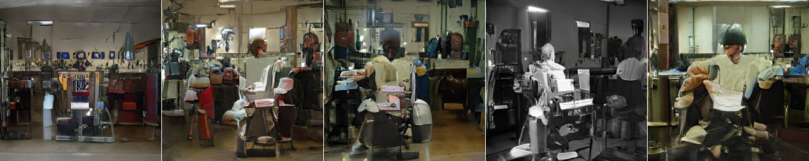

# ART185AI: Machine Learning and the Arts

Tuesdays and Thursdays, 9-10.50, Arts 1344. Office hours TBD.

## Description

This class provides a high-level introduction to machine learning for art and art history. Many of the tasks that machine learning models are facing today are aesthetic tasks, ranging from the classification of images (CNNs) to the generation of completely new images (GANs). At the same time, the technical opacity of machine learning models makes it difficult to properly evaluate what exactly is being learned to solve these tasks. Hence, the once speculative phenomenological question "how does the machine perceive the world" has become a real-world problem. We will approach this problem by means of technical and philosophical close readings of contemporary machine learning algorithms. The first part of the class will explore the history and philosophy of computer-generated images, while the second part of the class will be dedicated to studying and replicating concrete machine learning results, mostly from the domain of image synthesis. At the end of the class, participants will be able to evaluate future developments in machine learning for art and art history, as well as potentially integrate machine learning approaches into their own practice.

## Grading

In-class participation: 25%, assignments: 25%, final project/paper: 50 %.

## Info 

- No prior programming skills are required but an interest in building such skills is expected. 
- Please note: this syllabus is subject to change until the begin of the Winter quarter. 
- :book: = article/book/blog post, :computer: = close reading of source code, :vhs: = video.
- Class code repository can be found here: https://github.com/zentralwerkstatt/ART185AI

## Syllabus

### 1/8: Introduction

- :vhs: [Superintelligence. The Idea That Eats Smart People](https://www.youtube.com/watch?v=kErHiET5YPw) (2016)

### 1/10: The Current State of Machine Learning and the Arts

- :book: Nake, Frieder, [There Should Be No Computer Art](http://computer-arts-society.com/uploads/page-18.pdf) (1971)
- :book: Vincent, James, [How Three French Students Used Borrowed Code to Put the First AI Portrait In Christie's](https://www.theverge.com/2018/10/23/18013190/ai-art-portrait-auction-christies-belamy-obvious-robbie-barrat-gans) (2018)
- :book: [Is Artificial Intelligence Set to Become Art’s Next Medium?](https://www.christies.com/features/A-collaboration-between-two-artists-one-human-one-a-machine-9332-1.aspx
) (2018)
- :book: [Has Artificial Intelligence Brought Us the Next Great Art Movement? Here Are 9 Pioneering Artists Who Are Exploring AI’s Creative Potential](https://news.artnet.com/market/9-artists-artificial-intelligence-1384207) (2018)
- [Twitter discussion](https://twitter.com/DrBeef_/status/1055285640420483073) (2018)

### 1/15: History of Computer Art, 1965

- :book: Nees, Georg, Computer-grafik (1965, German, translation [here](http://dada.compart-bremen.de/docUploads/Bense_Manifest.pdf), but browse the images in the original book)
- :book: Klütsch, Christoph, Computer Graphic-Aesthetic Experiments Between Two Cultures (2007)
- :vhs: [Manfred Mohr video works playlist](https://www.youtube.com/playlist?list=PL_0LKGAwYuw7nT63wqzVLFvW2L4rw53qb)
- :vhs: [Manfed Mohr interview](https://www.youtube.com/watch?v=THaQGTMWhFA)

### 1/17: History of Computer Art, 1970

[Manfred Mohr](http://www.emohr.com), P-036, "White Noise" (1970)

- :vhs: [The Incredible Machine](https://www.youtube.com/watch?v=iwVu2BWLZqA) (1968)
- :vhs: [Deactivation of HAL9000 from Stanley Kubrick's 2001: A Space Odyssey](https://www.youtube.com/watch?v=I1iRWKARwTY) (1968)
- :book: Higgins, Dick, Computers for the Arts (1968)
- :book: Klütsch, Christoph, The Summer 1968 in London and Zagreb: Starting or End Point for Computer Art? (2005)
- :book: Cybernetic Serendipity: The Computer and the Arts (1969, 2018 reprint)
- :book: Software. Information Technology: Its New Meaning for Art (1970)
- :book: New Tendencies 4: Computers and Visual Research (1970)

Weekly assignment: 300-word analysis or reconstruction of artwork from one of the exhibition catalogs or from http://dada.compart-bremen.de/

### 1/22: Critical Technical Practice

- :book: Oliver, Julian, [The Critical Engineering Manifesto](http://conceptlab.com/criticalmaking/PDFs/CriticalMaking2012Hertz-Manifestos-pp41-OliverSavicicVasiliev-TheCriticalEngineeringManifesto.pdf) (2012)
- :book: Csikszentmihalyi, Chris, [Sixteen Reflective Bits](http://conceptlab.com/criticalmaking/PDFs/CriticalMaking2012Hertz-Manifestos-pp23to32-Csikszentmihalyi-SixteenReflectiveBits.pdf) (2012)
- :book: Agre, Philip, [Toward a Critical Technical Practice: Lessons Learned in Trying to Reform AI](http://polaris.gseis.ucla.edu/pagre/critical.html) (1997)

### 1/24: Bias

- :vhs: [The Trouble with Bias](https://www.youtube.com/watch?v=fMym_BKWQzk&t=698s) (2017)
- :book: Murphy, Heather [Why Stanford Researchers Tried to Create a 'Gaydar' Machine](https://www.nytimes.com/2017/10/09/science/stanford-sexual-orientation-study.html), New York Times (2017)
- :book: Mattson, Greggor [Artificial Intelligence Discovers Gayface. Sigh](https://greggormattson.com/2017/09/09/artificial-intelligence-discovers-gayface/) (2017)
- [Gender Shades](http://gendershades.org/)
- Crispin, Sterling, [Data Masks](http://www.sterlingcrispin.com/data-masks.html) (2013-2015)
- Blas, Zach, [Facial Weaponization Suite](http://www.zachblas.info/works/facial-weaponization-suite/) (2011-2014)

### 1/29: Turing Test

- :book: Turing, Alan M., [Computing Machinery and Intelligence](https://www.jstor.org/stable/2251299) (1950)
- :book: Weizenbaum, Joseph, ELIZA. A Computer Program for the Study of Natural Language Communication between Man and Machine (1966)

### 1/31: Chinese Room

- :book: Searle, John R., Minds, Brains, and Programs (1980)
- :book: Searle, John R., The Chinese Room (1999)
- :book: Cole, David, [The Chinese Room Argument](https://plato.stanford.edu/entries/chinese-room/) (2015)

### 2/5: Neural Networks

- [The Neural Network Zoo](http://www.asimovinstitute.org/neural-network-zoo/) (2016)
- :vhs: [But What Is a Neural Network?](https://www.youtube.com/watch?v=aircAruvnKk) (2017, parts 1-3)

### 2/7: Deep Learning

- :book: Andrey Kurenkov, [A 'Brief' History of Neural Nets and Deep Learning](http://www.andreykurenkov.com/writing/a-brief-history-of-neural-nets-and-deep-learning/) (2015)

Weekly assignment: Read a current ML paper from arxiv.org and summarize it in 300 words.

### 2/12: Hands-on Python I

- Setting up Miniconda/Jupyter/Colab

### 2/14: Hands-on Python II

- Basic concepts

### 2/19: Hands-on Python III

- Advanced concepts

### 2/21: Hands-on Python IV

- Introduction to Keras/TensorFlow/PyTorch/[Google Seedbank](https://research.google.com/seedbank/)

### 2/26: Deep Dreaming I

Deepdream experiment by [Kyle McDonald](http://www.kylemcdonald.net/) (2015)

- :book: Mordvintsev, Alexander et. al., [Inceptionism: Going Deeper into Neural Networks](https://research.googleblog.com/2015/06/inceptionism-going-deeper-into-neural.html) (2015)
- :computer: [https://github.com/google/deepdreamgoogle/deepdream](https://github.com/google/deepdreamgoogle/deepdream)
- :book: Chayka, Kyle [Why Google's Deep Dream is Future Kitsch](https://psmag.com/environment/googles-deep-dream-is-future-kitsch) (2015)
- :book: Rayner, Alex [Can Google’s Deep Dream Become an Art Machine?](https://www.theguardian.com/artanddesign/2016/mar/28/google-deep-dream-art) (2016)

### 2/28: Feature Visualization

- :book: Olah, Chris, [Feature Visualization](https://distill.pub/2017/feature-visualization) (2017)
- :book: Olah, Chris, [The Building Blocks of Interpretability](https://distill.pub/2018/building-blocks) (2018)
- :computer: Class Jupyter notebook

Weekly assignment: Create your own deep dream or feature visualization images by experimenting with *datasets* and *hyperparameters* in the class notebook.

### 3/5: Language Models

- :computer: Class Jupyter notebook

### 3/7: GANs I

Barbershops genrated with the BigGAN algorithm (2018)

- :book: Sarin, Helena, [Playing a game of GANstruction](https://thegradient.pub/playing-a-game-of-ganstruction/) (2018)
- :computer: Class Jupyter notebook

### 3/12: GANs II

- :computer: Class Jupyter notebook

### 3/14: Final projects

- Final project presentation

## Further Resources

For a list of further resources, see: [https://github.com/zentralwerkstatt/teaching/blob/master/more.md](https://github.com/zentralwerkstatt/teaching/blob/master/more.md)