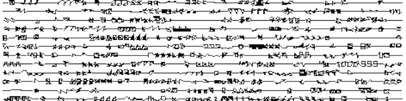
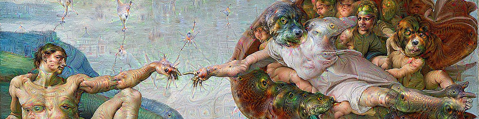
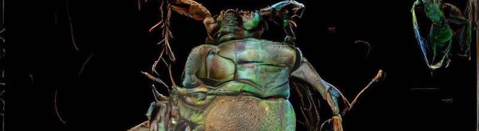
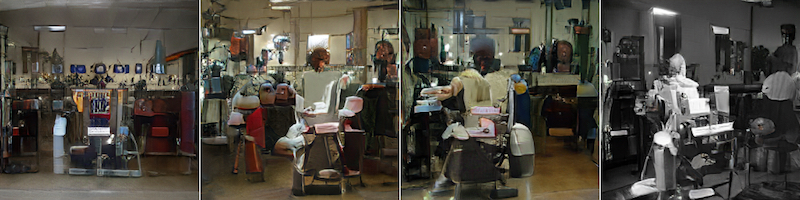

# ART185AI: Machine Learning and the Arts

Tuesdays and Thursdays, 9-10.50, Arts 1344. Office hours TBD.

Email: offert@ucsb.edu

## Description

This class provides a high-level introduction to machine learning for art and art history. Many of the tasks that machine learning models are facing today are aesthetic tasks, ranging from the classification of images (CNNs) to the generation of completely new images (GANs). At the same time, the technical opacity of machine learning models makes it difficult to properly evaluate what exactly is being learned to solve these tasks. Hence, the once speculative phenomenological question "how does the machine perceive the world" has become a real-world problem. We will approach this problem by means of technical and critical close readings of contemporary machine learning algorithms. The first part of the class will explore the history and philosophy of computer-generated images, while the second part of the class will be dedicated to studying and replicating concrete machine learning results, mostly from the domain of image synthesis. At the end of the class, participants will be able to evaluate future developments in machine learning for art and art history, as well as potentially integrate machine learning approaches into their own practice.

## Grading

In-class participation: 25%, assignments: 25%, final project/paper: 50 %.

## Info 

- No prior programming skills are required but an interest in building such skills is expected. 
- :book: = article/book/blog post, :computer: = close reading of source code, :vhs: = video (we will watch this together in class).
- Slides and readings that are not linked here for copyright reasons will be posted on GauchoSpace: [https://gauchospace.ucsb.edu/courses/course/view.php?id=37398](https://gauchospace.ucsb.edu/courses/course/view.php?id=37398)
- Class code repository: https://github.com/zentralwerkstatt/ART185AI

## Syllabus I: Theory

### 1/8: Introduction

- :book: [Superintelligence. The Idea That Eats Smart People](https://idlewords.com/talks/superintelligence.htm) (2016)
- :vhs: [Superintelligence. The Idea That Eats Smart People](https://www.youtube.com/watch?v=kErHiET5YPw) (2016)

### 1/10: The Current State of Machine Learning and the Arts

- :book: Nake, Frieder, [There Should Be No Computer Art](http://computer-arts-society.com/uploads/page-18.pdf) (1971)
- :book: Vincent, James, [How Three French Students Used Borrowed Code to Put the First AI Portrait In Christie's](https://www.theverge.com/2018/10/23/18013190/ai-art-portrait-auction-christies-belamy-obvious-robbie-barrat-gans) (2018)
- :book: [Is Artificial Intelligence Set to Become Art’s Next Medium?](https://www.christies.com/features/A-collaboration-between-two-artists-one-human-one-a-machine-9332-1.aspx
) (2018)
- :book: [Has Artificial Intelligence Brought Us the Next Great Art Movement? Here Are 9 Pioneering Artists Who Are Exploring AI’s Creative Potential](https://news.artnet.com/market/9-artists-artificial-intelligence-1384207) (2018)
- [Twitter discussion](https://twitter.com/DrBeef_/status/1055285640420483073) (2018)
- :book: [We Made Our Own Artificial Intelligence Art, And So Can You](https://www.wired.com/story/we-made-artificial-intelligence-art-so-can-you/) (2018)

Weekly assignment: Find an artwork that has been made using computers. Briefly (300 words max.) describe the artwork and the role the computer has played in its production. Send an image of the work and the description to me until next Monday at noon. We will review some of the works in class on Tuesday.

### 1/15: History of Computer Art I

- :book: Nees, Georg, Computer-grafik (1965, German, translation [here](http://dada.compart-bremen.de/docUploads/Bense_Manifest.pdf), but browse the images in the original book)
- :book: Klütsch, Christoph, Computer Graphic-Aesthetic Experiments Between Two Cultures (2007)
- :book: Higgins, Dick, Computers for the Arts (1968)
- :vhs: [Manfred Mohr video works playlist](https://www.youtube.com/playlist?list=PL_0LKGAwYuw7nT63wqzVLFvW2L4rw53qb)

### 1/17: History of Computer Art II

Part of P-036, "White Noise" by [Manfred Mohr](http://www.emohr.com) (1970)

- :book: Klütsch, Christoph, The Summer 1968 in London and Zagreb: Starting or End Point for Computer Art? (2005)
- :book: Cybernetic Serendipity: The Computer and the Arts (1969, 2018 reprint)
- :book: Software. Information Technology: Its New Meaning for Art (1970)
- :book: New Tendencies 4: Computers and Visual Research (1970)

Weekly assignment: Carefully prepare the readings for next week. Research unfamiliar concepts and note questions. Brief quiz on "Computing Machinery and Intelligence" next week.

### 1/22: Turing Test and Chinese Room

- :book: Gaboury, Jacob, [A Queer History of Computing](http://rhizome.org/editorial/2013/feb/19/queer-computing-1/) (2013)
- :book: Turing, Alan M., [Computing Machinery and Intelligence](https://www.jstor.org/stable/2251299) (1950)
- :book: Weizenbaum, Joseph, ELIZA. A Computer Program for the Study of Natural Language Communication between Man and Machine (1966)
- :book: Dijkstra, Edsger W., [On Anthropomorphism in Science](https://www.cs.utexas.edu/users/EWD/transcriptions/EWD09xx/EWD936.html) (1985)

### 1/24: Neural Networks

- [The Neural Network Zoo](http://www.asimovinstitute.org/neural-network-zoo/) (2016)
- :vhs: [But What Is a Neural Network?](https://www.youtube.com/playlist?list=PLZHQObOWTQDNU6R1_67000Dx_ZCJB-3pi) (2017, parts 1-4)
- :book: Andrey Kurenkov, [A 'Brief' History of Neural Nets and Deep Learning](http://www.andreykurenkov.com/writing/a-brief-history-of-neural-nets-and-deep-learning/) (2015)

## Syllabus II: Practice

### 1/29: Hands-on Python I

- :computer: [Setting Up](https://github.com/zentralwerkstatt/ART185AI/blob/master/N00_Setup.ipynb)

### 1/31: Hands-on Python II

- :computer: [Basics Concepts I](https://github.com/zentralwerkstatt/ART185AI/blob/master/N01_Basics.ipynb)

Weekly assignment: Finish the in-class exercies and push to the lab repository.

### 2/7: Hands-on Python III

- :computer: [Basic Concepts II](https://github.com/zentralwerkstatt/ART185AI/blob/master/N02_Basics.ipynb)

Weekly assignment: Finish the in-class exercies and push to the lab repository.

### 2/12: Hands-on Python IV

- :computer: [Advanced Concepts](https://github.com/zentralwerkstatt/ART185AI/blob/master/N03_Advanced.ipynb)

### 2/14: Hands-on Python V

- :computer: Introduction to [Keras](https://keras.io/)/[TensorFlow](https://www.tensorflow.org/), [PyTorch](https://pytorch.org/), [Google Seedbank](https://research.google.com/seedbank/)
- :computer: [Building/Reading a Working MNIST Classifier](https://github.com/zentralwerkstatt/ART185AI/blob/master/N04_MNIST.ipynb)

Weekly assignment: First final project proposal abstract (300 words) due next week.

## Syllabus III: Theory and Practice

### 2/19: Language Models

- :book: Karpathy, Andrej, [The Unreasonable Effectiveness of Recurrent Neural Networks](http://karpathy.github.io/2015/05/21/rnn-effectiveness/) (2015)
- :computer: Goldberg, Yoav, [The Unreasonable Effectiveness of Character-level Language Models](http://nbviewer.jupyter.org/gist/yoavg/d76121dfde2618422139)
- :computer: Class Jupyter notebook

### 2/21: Deep Dream

Deepdream experiment by [Kyle McDonald](http://www.kylemcdonald.net/) (2015)

- :book: Mordvintsev, Alexander et. al., [Inceptionism: Going Deeper into Neural Networks](https://research.googleblog.com/2015/06/inceptionism-going-deeper-into-neural.html) (2015)
- :computer: [https://github.com/google/deepdreamgoogle/deepdream](https://github.com/google/deepdreamgoogle/deepdream)
- :book: Chayka, Kyle [Why Google's Deep Dream is Future Kitsch](https://psmag.com/environment/googles-deep-dream-is-future-kitsch) (2015)
- :book: Rayner, Alex [Can Google’s Deep Dream Become an Art Machine?](https://www.theguardian.com/artanddesign/2016/mar/28/google-deep-dream-art) (2016)
- :vhs: [Neverending Story music video](https://www.youtube.com/watch?v=IVBmLRPiQjQ) (2019)

Weekly assignment: Final project proposal due next week.

### 2/26: Feature Visualization

- :book: Olah, Chris, [Feature Visualization](https://distill.pub/2017/feature-visualization) (2017)
- :book: Olah, Chris, [The Building Blocks of Interpretability](https://distill.pub/2018/building-blocks) (2018)
- :computer: Class Jupyter notebook

### 2/28 Bias and Interpretability

- :vhs: [The Trouble with Bias](https://www.youtube.com/watch?v=fMym_BKWQzk&t=698s) (2017)
- :book: Murphy, Heather [Why Stanford Researchers Tried to Create a 'Gaydar' Machine](https://www.nytimes.com/2017/10/09/science/stanford-sexual-orientation-study.html), New York Times (2017)
- :book: Mattson, Greggor [Artificial Intelligence Discovers Gayface. Sigh](https://greggormattson.com/2017/09/09/artificial-intelligence-discovers-gayface/) (2017)
- [Gender Shades](http://gendershades.org/)
- :computer: [How to Make a Racist AI without Really Trying](http://blog.conceptnet.io/posts/2017/how-to-make-a-racist-ai-without-really-trying/)
- :book: Selbst, Andrew D. et. al., [The Intuitive Appeal of Explainable Machines](https://papers.ssrn.com/sol3/papers.cfm?abstract_id=3126971) (2018)
- :book: Frank Pasquale, The Black Box Society (2015), excerpts
- [EU GDPR](https://eur-lex.europa.eu/legal-content/EN/TXT/HTML/?uri=CELEX:32016R0679&from=EN)

### 3/5: No class

- Conference at Humboldt University, Berlin

### 3/7: Style Transfer

Style transfer art by [Sofia Crespo](https://www.instagram.com/soficrespo91/) (2018)

- :computer: Class Jupyter notebook
- :computer: Playground: https://reiinakano.github.io/arbitrary-image-stylization-tfjs/

### 3/12: GANs

Barbershops genrated with the BigGAN algorithm (2018)

- :book: Sarin, Helena, [Playing a game of GANstruction](https://thegradient.pub/playing-a-game-of-ganstruction/) (2018)
- :book: Atken, Memo, [Deep meditations: a meaningful exploration of inner self, a controlled navigation of latent space](https://medium.com/@memoakten/deep-meditations-meaningful-exploration-of-ones-inner-self-576aab2f3894) (2018)
- :book: McDonald, Kyle, [How to recognize fake AI-generated images](https://medium.com/@kcimc/how-to-recognize-fake-ai-generated-images-4d1f6f9a2842) (2018)
- :computer: Class Jupyter notebook
- :computer: Playground: https://ganbreeder.app/
- :computer: Playground: http://gandissect.csail.mit.edu/

### 3/14: Final projects

- Final project presentation

## Further Resources

For a list of further resources, see: [https://github.com/zentralwerkstatt/teaching/blob/master/more.md](https://github.com/zentralwerkstatt/teaching/blob/master/more.md)