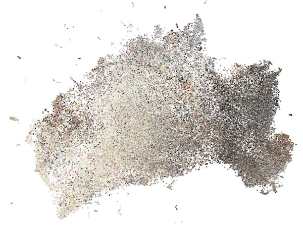

# Distant Viewing. Bilder als Daten, Daten als Bilder

## Ort und Zeit

Freitags, 10-12
Nägelsbachstr. 49c
Raum 02.313

## Kursbeschreibung

Die Produktion und die Analyse von Bildern sind als Kulturtechniken traditionell strikt getrennt. Für die digital humanities, insbesondere für die digitale Kunstgeschichte, gilt diese strikte Trennung jedoch in zunehmendem Maße nicht mehr: Wo alle Bilder technische Bilder sind, wo Bilder als Daten und Daten als Bilder verstanden werden können, vermischen sich Konzepte und Verfahren der Bildproduktion und der Bildanalyse. Der Kurs "Distant Viewing. Bilder als Daten, Daten als Bilder" schlägt deshalb einen historischen und systematischen Bogen von der computergestützten Verbildlichung von Daten hin zur computergestützten Analyse von Bildern. Teilnehmerinnen und Teilnehmer des Kurses setzen sich einerseits mit den philosophischen Grundlagen technischer Bilder auseinander, und erlernen andererseits konkrete Methoden, die die Analyse von umfangreichen Bilddatensätzen in den digital humanities erleichtern.

## Referate

Referate von ca. 30 Min. zu den (theoretischen) Themen des Kurses werden in der ersten Kurswoche vergeben, siehe Lektüreliste. In der Regel bestehen Referate in der detaillierten Lektüre und Vorstellung eines Textes.

## Prüfungsleistung

Hausarbeit, praktisches Projekt

## Lektüreliste

Soweit nicht direkt verlinkt, finden Sie alle Volltexte im freigegebenen Google-Drive-Ordner. Den Link hierzu finden Sie in der Begrüßungsemail zum Kurs.

### 25.10. Einführung

### 01.11. [Allerheiligen]

### 08.11. Python für visuelles maschinelles Lernen

- Einführung in die im Kurs verwendeten Entwicklungsumgebung sowie Werkzeuge und Pakete
- Bildverarbeitung mit Python

### 15.11. Maschinisierung von Kopfarbeit [Referat]

- Descartes, René. [Abhandlung über die Methode des richtigen Vernunftgebrauchs](https://www.textlog.de/descartes-methode.html) (1637). Kapitel V.
- Kittler, Friedrich. "Protected Mode". In: Draculas Vermächtnis. Technische Schriften. Leipzig: Reclam, 1993.
- Turing, Alan M.. "Computing Machinery and Intelligence." Mind 59, Nr. 236 (1950), 433–60. Dt. Übersetzung: "Kann eine Maschine denken?" In: Künstliche Intelligenz. Philosophische Probleme. Stuttgart: Reclam, 1994.
- Nake, Frieder. Ästhetik als Informationsverarbeitung. Grundlagen und Anwendung der Informatik im Bereich ästhetischer Produktion und Kritik. Einleitung. Wien: Springer, 1974.

### 22.11. [Konferenz "Image Servitude", HfG]

### 29.11. Web scraping und data set building I

### 06.12. Technische Bilder [Referat]

- [...]

### 13.12. Web scraping und data set building II

### 20.12. Distant Viewing

- Arnold, Taylor, und Lauren Tilton. "[Distant viewing: analyzing large visual corpora](https://www.distantviewing.org/pdf/distant-viewing.pdf)." In: Digital Scholarship in the Humanities (2019).
- Bell, Peter, und Leonardo Impett. "Ikonographie und Interaktion. Computergestützte Analyse von Posen in Bildern der Heilsgeschichte." In: Das Mittelalter 24, Nr. 1 (2019): 31-53.
- Moretti, Franco. "['Operationalizing': or, the function of measurement in modern literary theory](https://litlab.stanford.edu/LiteraryLabPamphlet6.pdf)." Stanford Literary Lab Pamphlet Nr. 6 (2013).
- Russel, Bertrand. "[Vagueness](http://bactra.org/Russell/vagueness/)." (1923).
- Underwood, Ted. Distant Horizons. Auszüge. University of Chicago Press, 2019.

### 10.01. *Classifying* und *clustering* I

### 17.01. Maschinisierung von Wahrnehmung [Referat]

- Babbage, Charles. "On the Economy of Machinery and Manufactures". In: *Babbage's Calculating Engines. Being a Collection of Papers Relating to Them; Their History, and Construction*. Cambridge: Cambridge University Press, 2010. Dt. Übersetzung in: Die Ökonomie der Maschine. Berlin: Kadmos Kulturverlag, 1999.
- Benjamin, Walter. "Der Autor als Produzent." In: Gesammelte Schriften II-2. Frankfurt am Main: Suhrkamp, 1974.
- Hayek, Friedrich August. "[The use of knowledge in society](https://www.jstor.org/stable/pdf/1809376.pdf)." In: The American Economic Review 35, Nr. 4 (1945): 519-530.
- Pasquinelli, Matteo. "[3000 Years of Algorithmic Rituals: The Emergence of AI from the Computation of Space](kim.hfg-karlsruhe.de/3000-years-of-algorithmic-rituals/)." e-flux journal #101 (2019).

### 24.01. *Classifying* und *clustering* II

### 31.01. Künstliche Intelligenz [Referat]

- Agre, Philip E.. "[The Soul Gained and Lost. Artificial Intelligence as a Philosophical Project](https://web.stanford.edu/group/SHR/4-2/text/agre.html)." SEHR 4, no. 2, (1995).
- [...]

### 07.02. Abschlussdiskussion und Vorstellung Abschlussarbeiten